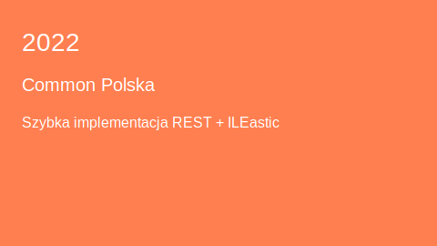

# IBM i Presentations

A chronological list of presentations with thumbnails and direct links to the presentation files (newest first).

## Presentations

### 2025 — Politechnika Wrocławska — IBM i od kuchni

### 2024 — Common Europe — Camel & IBM i

### 2024 — Common Polska — End-to-end development Process (CICD)

### 2023 — Common Polska — Szybka implementacja API REST z wykorzystaniem AI

### 2022 — Common Polska — Does Camel like IBM i?

### 2022 — Common Polska — Szybka implementacja REST API w oparciu o ILEastic

### 2022 — Common Polska — Apache Camel i IBM i - integracja usług

## Usage
Click the thumbnails to open the presentation files in the repository viewer. If you see broken links, the filenames contain spaces or non-ASCII characters — GitHub will handle URL-encoded paths; locally you can open the files from the directories listed.
